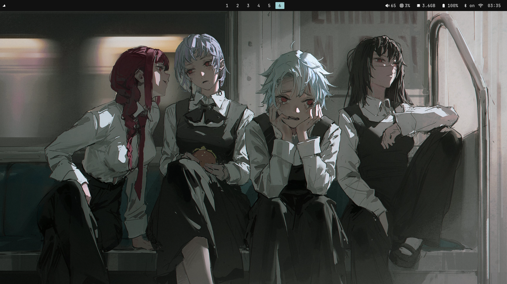
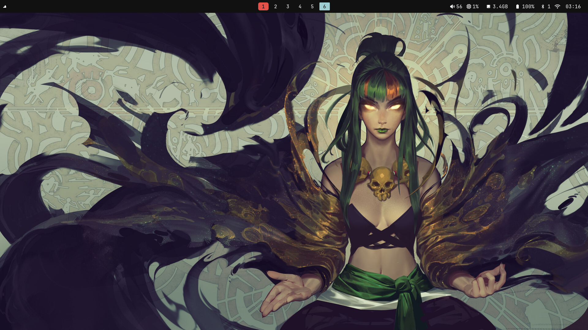
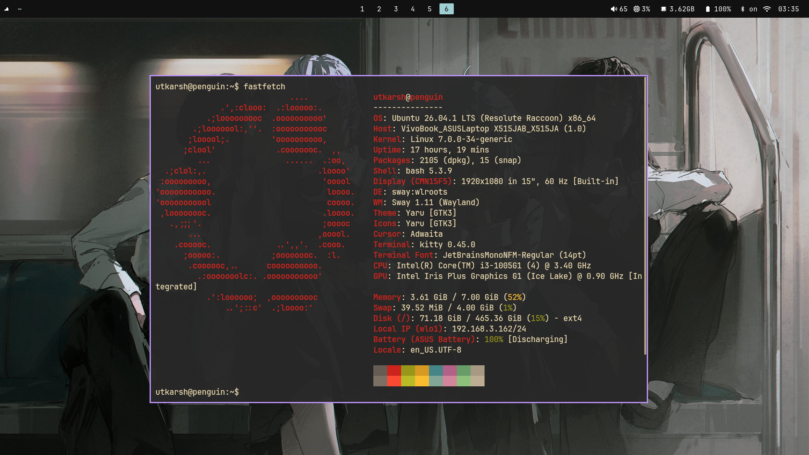
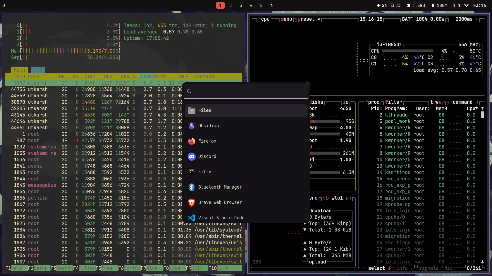
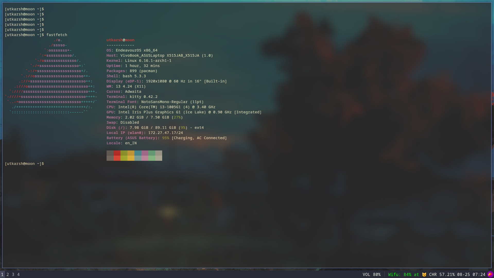

<h2 align="center"> ━━━━━━  ❖  ━━━━━━ </h2>

# <samp> Utkarsh' dotfiles </samp>

<div >
 
 
</div>

*** 


>[!NOTE]
>I will update it as soon as i updated/ changed something and done with assigments and exams <3 


## <samp>bluetooth config- </samp>

```bash
first install `bluez` & `bluez-utils
-----------------------------------------
systemctl enable bluetooth.service
systemctl start bluetooth.service
  bluetoothctl
  scan on

  pair mac_address
  trust mac_address
  connect mac_address
  quit 
 ```

## <span> packages using along with Sway - </span>
``` bash
  - sway/ swaylock/ swayidle
  - kitty
  - blueman-manage
  - wofi
  - waybar
  - nerd-font
  - grim (for screenshot)
  

  extra packages in case i forget-
  1. htop and ptop
  2. nmtui   ? => network manager 
  3. blueman-manager ? => bluetooth mangar
  4. brain.exe
```

| <samp> Previews </samp> |  </br>  </br>  </br> |
| --- | --- |


<p align="center">
   
</p>
